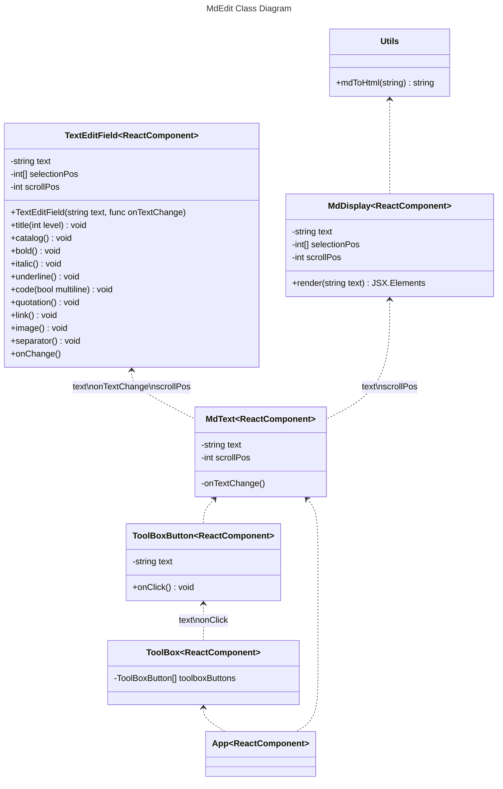

## 빌드 방법

```
$ yarn install
$ yarn build
$ yarn make
```

---
[Demo video link](https://youtu.be/TcpGRWoLcr4)

---

### 아키텍처 개선 구상


```mermaid
---
title: MdEdit Class Diagram
---
classDiagram

	class App~ReactComponent~ {
  }


  class MdText~ReactComponent~ {
    -string text
    -onTextChange()
		-int scrollPos
  }

	class TextEditField~ReactComponent~ {
		-string text
		-int[] selectionPos
		-int scrollPos
		+TextEditField(string text, func onTextChange) 
		+title(int level) void
		+catalog() void
    +bold() void
		+italic() void
		+underline() void
		+code(bool multiline) void
		+quotation() void
		+link() void
		+image() void
		+separator() void
    +onChange()
	}

	class MdDisplay~ReactComponent~ {
		-string text
		-int[] selectionPos
		-int scrollPos
		+render(string text) JSX.Elements
  }

  class ToolBox~ReactComponent~ {
		-ToolBoxButton[] toolboxButtons
  }
	     
  class ToolBoxButton~ReactComponent~ {
    -string text
    +onClick() void
  }
  class Utils {
    +mdToHtml(string) string
  }
  Utils <.. MdDisplay
  ToolBoxButton <.. ToolBox: text\nonClick
	ToolBox <.. App
  MdText <.. App
	MdText <..ToolBoxButton
	TextEditField <.. MdText : text\nonTextChange\nscrollPos
	MdDisplay	<.. MdText : text\nscrollPos
```
